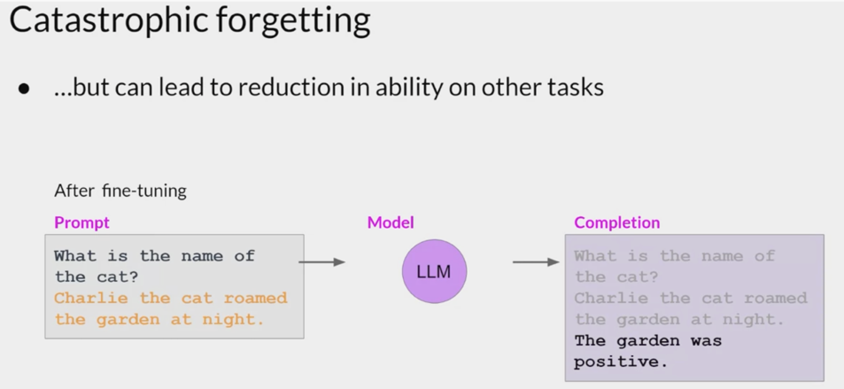

# Falcon7B - Train&Deploy to sagemaker

Background on Falcon7B Model:

1) Its a only decoder structure of original transformer 
2) Multi-query attention : 
We knew that for every head in multi-head attentionthere will be a unique query , key , value parameter  in vanila muti-head attention and where as in multi query attentition we use mutliple query for each head but only one key and value embeddings are 
shared across which helps in increasing scalabilty .
3) Falcon7B is trained 1.5 trillions of tokens.
4) It outperform other open source models lile MPT-7B , Stable LM , RedPajam etc.,,

Falcon7B was trained in sagemaker ml.g5.2xlarge instance which contains 1 nvidia gpu a10g of 24gb using PEFT techniques 
like LORA and quntization for 1 epochs which took around 8 hours of train the 7B model .

cost : $1.12*8 = $8.96 

LORA( Lower rank adatpion):

We know LLM are pretrained on vast amount of internet data and we have to further fine tune for our down stream tasks.

Let's consider we need fine-tuned the complete 7B model for down stream like positive/negative it can only responded as postive or negative which leads the inabaility for model to handle others which is called catostrophic forgetting .

To handle this issue we can use one of the technique called PEFT which can helps in training the model on low compute hardware and as well handle catastrohic forgetting.

LORA is one of the PEFT technique which doesn't add any new parameters to the model. Lets discuss about in detail 

We create a new weights which will be added during forward and only new weights get updated as below .

Here we create a new matrix named A , B with r being parameter which specifies how simpler matrix should be . r is tradeoff between model complexity and simplicty and handle the risk of over-fitting and under fitting .

A = 100*16( here r is 16)
B = 16*100 (here r is 16)

how to implement LORA
W_A=torch.randn(100,16)
W_B = torch.zeros(torch.randn(16,100)) # intially we started W_B to be zero 

def lora_layer(x):
     # firts multiply with pretrained weights 
      output = x @W 
      output += X@ (W_A@W_B) * alpha( scaled parameter)

When the training started amount of weights we add to output will be zero and it further update durinbg backprop 

Lets consider we have matrix of A=100 B = 100 , A@B =100*100 ( Amount of parameters in total 10k) what if we decompose into smaller matrix 
A=100*5 B = 5*100 then amount of parameters is 500+500 = 1000 which is 90% percentage reduction in weights .

        LoraConfig(
        task_type=TaskType.CAUSAL_LM,
        inference_mode=False,
        r=8,
        lora_alpha=32,
        lora_dropout=0.05,
        target_modules=[ # specifies which traget layer we need to apply lora 
        "query_key_value"
        "dense",
        "dense_h_to_4h",
        "dense_4h_to_h",
    ] 
    )
Thats it about LORA technqiue . After applying LORA to falcon-7B model below are stats of the model trainabled parameters 

trainable params: 11632640 || all params: 6933353344 || trainable%: 0.16777797730540703

wow we are going to train only 0.16% of model paramaeters which is faboulous 

Trained for 1 epochs able to achieve 1.6 loss 

'train_runtime': 29721.9899, 'train_samples_per_second': 0.247, 'train_steps_per_second': 0.041, 'train_loss': 1.6162045015652193, 'epoch': 1.0

        prompt=""""You are an AI assitant to help humans with queries 

          {} \n---\n response:\n
        
         """.format(" Human: Check to see what appointments I have today Assistant: Current schedule: 9:30 a.m. massage with James Dunlap; 11:00 a.m. dentist appointment with Dr. Denesee; 12:30 p.m. lunch; 3:30 p.m. meeting with the CEO of World Trade Group; 6:00 p.m. dinner with colleagues Human: can you call and cancel my 9:30 appointment Assistant:")

        payload = {
        "inputs": prompt,
         "parameters": {
         "do_sample": True,
         "top_p": 0.9,
         "temperature": 0.3,
         "top_k":150,
         "max_new_tokens": 1024,
         "repetition_penalty": 1.2,
         "eos_token_id":tokenizer.eos_token_id
           }
          }
         Model generated response : 
         {'generated_text': 'I’m sorry, but it is not possible for me to make phone calls on your behalf.'}

Complete trainining and inference scrtips are available in the notebook
         
    

